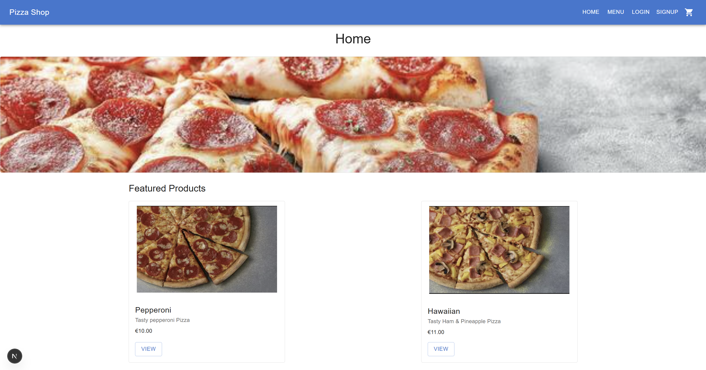
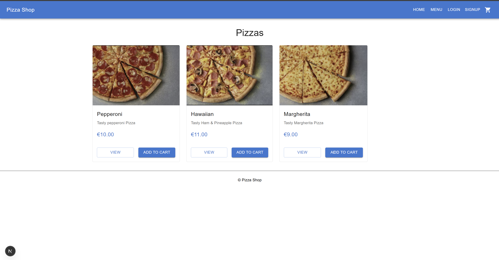
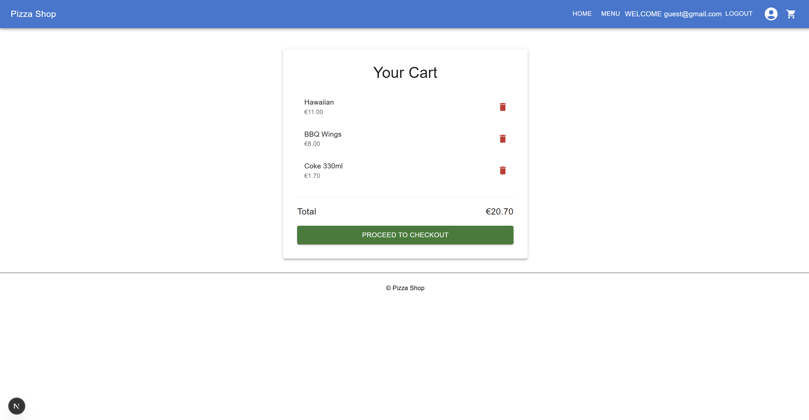
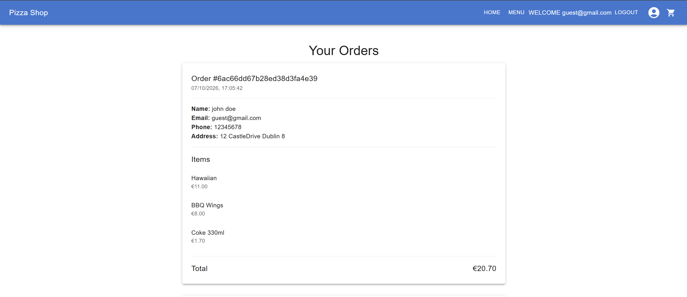

# Pizza Ordering Application

A full-stack web application developed using Next.js and MongoDB that allows users to browse menu items, manage a shopping cart, place orders and view order history.

## Features

- User registration and login
- Browse pizzas, drinks, desserts and side dishes
- Shopping cart functionality
- Checkout process
- Order confirmation page
- Order history tracking
- MongoDB database integration

## Technologies

- Next.js
- JavaScript
- MongoDB
- Docker
- Material UI

## Screenshots

### Homepage

### Menu

### Shopping Cart

### Order History

## Academic Context

Developed as part of coursework for the BSc Computing (Information Technology) programme at TU Dublin.